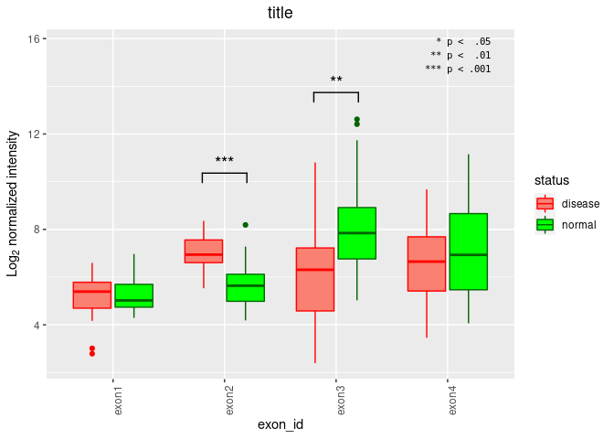
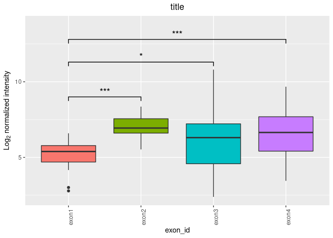
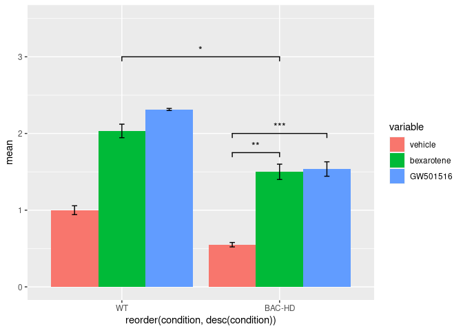
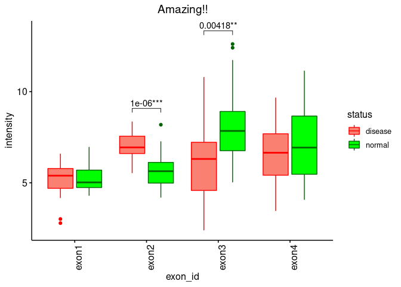
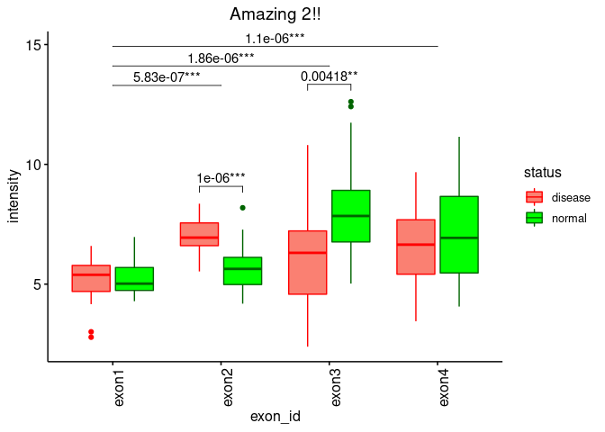
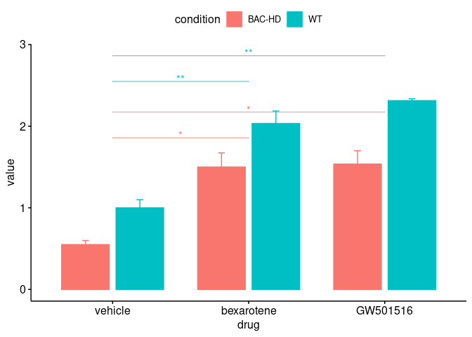
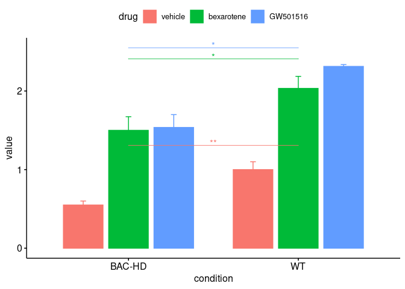

P-values
================
bwiley
1/29/2021

## How to add some p-value annotations

### R packages

1.  ggsignif
2.  ggpubr and rstatix

Data and functions

``` r
## boxplot data multiple comparisons
set.seed(1)
norm.exon1 <- rnorm(25, 5, 1)
norm.exon2 <- rnorm(25, 7, 1)
norm.exon3 <- rnorm(25, 6, 2)
norm.exon4 <- rnorm(25, 6.5, 2)
tumor.exon1 <- rnorm(25, 5.2, 1)
tumor.exon2 <- rnorm(25, 6.1, 1)
tumor.exon3 <- rnorm(25, 8, 2)
tumor.exon4 <- rnorm(25, 7, 2)
## 0=norm, 1=tumor
groups <- c(rep(0,5), rep(1,8), rep(0,15), rep(1,17), rep(0,5))
samples <- c(paste0("norm", 1:5), paste0("tumor", 1:8),
             paste0("norm", 6:20), paste0("tumor", 9:25), paste0("norm",21:25))
box.dat <- as.data.frame(rbind(c(norm.exon1, tumor.exon1),
                               c(norm.exon2, tumor.exon2),
                               c(norm.exon3, tumor.exon3),
                               c(norm.exon4, tumor.exon4)))
rownames(box.dat) <- c("exon1", "exon2", "exon3", "exon4")
colnames(box.dat) <- c(paste0("norm", 1:25), paste0("tumor", 1:25))

box.dat <- box.dat[, samples]

## melt for ggplot2
exons <- box.dat
groups.all <- rep(groups,nrow(exons))
groups.all <- as.factor(groups.all)
exons <- as.data.frame(t(exons))
exons.stack <- stack(exons)
d <- data.frame(exons.stack,groups)
colnames(d) <- c("intensity", "exon_id", "status")
d$exon_id <- as.factor(d$exon_id)
d$status <- as.factor(d$status)

t.test2 <- function(x,sam,v=F) {
  x <- as.numeric(x)
  out <- t.test(as.numeric(x[sam]),as.numeric(x[!sam]),alternative="two.sided",var.equal=v)
  o <- as.numeric(c(out$statistic,out$p.value,out$conf.int[1],out$conf.int[2]))
  names(o) <- c("test_statistic","p.value","lower_ci","upper_ci")
  return(o)
}
```

## Box Plots

### ggsignif

``` r
## manually add since its grouped t.test
p.values <- t(apply(box.dat,1,t.test2,sam=as.logical(groups),v=F))[,'p.value']
labels <- symnum(p.values, corr = FALSE, 
                 cutpoints = c(0,  .001,.01,.05, 1), 
                 symbols = c("***","**","*",""))
## get y-values for astericks, change the +2 for your data
y.values <- sapply(split(d, d$exon_id), 
       function(x){max(sapply(split(x, x$status), 
                              function(xx){boxplot(xx$intensity, plot=F)$stats[5, ]}))})+2
n.s <- p.values > .05
x.min <- (c(1:length(unique(d$exon_id)))-.2)[!n.s]
x.max <- (c(1:length(unique(d$exon_id)))+.2)[!n.s]
## don't plot significant annotation


ggplot(d, aes(x=exon_id, y=intensity, fill = status, color = status)) +
    geom_boxplot() +
    scale_fill_manual(values=c("salmon", "green"), labels = c("disease", "normal")) +
    scale_color_manual(values=c("red", "darkgreen"), labels = c("disease", "normal")) +
    ylab(expression(paste("Log"[2], " normalized intensity"))) +
    ggtitle("title") +
    theme(axis.text.x=element_text(angle=90),
          plot.title = element_text(hjust = 0.5)) +
    geom_signif(y_position = y.values[!n.s], annotations = labels[!n.s], xmin = x.min, xmax = x.max, color = "black", textsize=5)  +
    annotate("text", x=length(unique(d$exon_id))-.2, y=max(d$intensity)+3, label = "
  * p <  .05
 ** p <  .01
*** p < .001",
             family = "DejaVu Sans Mono",
             hjust = 0,
             size=2.8) + 
  ylim(min(d$intensity), max(y.values)+2)
```

<!-- -->

``` r
## standard across exons. still should do manual p-value and heights
## example disease only

## pairwise
exon.df <- t(combn(c("exon1", "exon2", "exon3", "exon4"),2))

t.test3 <- function(exons,x,v) {
  x1 <- x$intensity[x$exon_id==exons[1]]
  x2 <- x$intensity[x$exon_id==exons[2]]
  t <- t.test(x1, x2 ,alternative="two.sided",var.equal=v)
  return(t$p.value)
}

p.values <- t(apply(exon.df, 1, t.test3, x=d[d$status==0,], v=T))
start <- exon.df[,1]
end <- exon.df[,2]
label <- symnum(p.values, corr = FALSE, 
                cutpoints = c(0, .001, .01, .05, 1), 
                symbols = c("***","**","*",""))
## y-values manually for astericks, you have to graph it first really to see 
## where you want them
y <- c(9, 11.3, 12.8, 12, 12.5, 13)

annotation_df <- data.frame(p.values=p.values[1,],
                            start=start,
                            end=end,
                            label=label[1,],
                            y=y)
annotation_df <- annotation_df[annotation_df$p.values < .05, ]

ggplot(d[d$status==0,], aes(x=exon_id, y=intensity, fill = exon_id)) +
  geom_boxplot() +
  ylab(expression(paste("Log"[2], " normalized intensity"))) +
  ggtitle("title") +
  theme(axis.text.x=element_text(angle=90),
        plot.title = element_text(hjust = 0.5),
        legend.position = "none") +
  geom_signif(y_position = annotation_df$y, annotations = annotation_df$label, xmin = annotation_df$start, xmax = annotation_df$end, color = "black", textsize = 5) +
  ylim(NA, max(annotation_df$y)+1)
```

<!-- -->

## Bar Plot

Let’s just say you already have the significant values then you can just
add them with ggsignif

``` r
# data
# n = 3 replicates for each bar
vehicle.wt <- c(1,1.1,0.9)
vehicle.bac <- c(0.5,0.6,0.55)
bex.wt <- c()
df1 <- data.frame("vehicle"=c(1,1.1,0.9,0.5,0.6,0.55),
                 "bexarotene"=c(2,2.2,1.9,1.3,1.6,1.6),
                 "GW501516"=c(2.3,2.3,2.34,1.35,1.61,1.65),
                 "condition"=c(rep("WT",3), rep("BAC-HD", 3)))
library(reshape2)
df.melt <- melt(df1, id="condition")

library(dplyr)
```

    ## 
    ## Attaching package: 'dplyr'

    ## The following objects are masked from 'package:stats':
    ## 
    ##     filter, lag

    ## The following objects are masked from 'package:base':
    ## 
    ##     intersect, setdiff, setequal, union

``` r
dat <- df.melt %>%
  group_by(variable, condition) %>%
  summarise( 
    n = n(),
    mean=mean(value),
    sd=sd(value)
  ) %>%
  mutate("se"=sd/sqrt(n))
```

    ## `summarise()` regrouping output by 'variable' (override with `.groups` argument)

``` r
## add a geom_signif for each significance
ggplot(dat, aes(x=reorder(condition, desc(condition)), y=mean, fill=variable)) +
  geom_bar(position = position_dodge(width=0.9), stat = "identity") +
  geom_errorbar(aes(ymin=mean-se, ymax=mean+se), width=.1,
                position = position_dodge(width=0.9)) +
  ## first 1
  geom_signif(y_position=c(1.75, 2.0), xmin=c(1.7, 1.7), xmax=c(2, 2.3),
              annotation=c("**", "***"), tip_length=0.03) +
  ## second 1 
  geom_signif(y_position=3, xmin=1, xmax=2,
              annotation=c("*"), tip_length=0.03) +
  ylim(NA, 3.5)
```

<!-- -->

## ggpubr

``` r
##https://www.datanovia.com/en/blog/how-to-add-p-values-onto-a-grouped-ggplot-using-the-ggpubr-r-package/
library(ggpubr)
library(rstatix)
```

    ## 
    ## Attaching package: 'rstatix'

    ## The following object is masked from 'package:stats':
    ## 
    ##     filter

``` r
stat.test <- d %>%
  group_by(exon_id) %>%
  t_test(intensity ~ status) %>%
  add_significance(p.col = "p",
                   cutpoints = c(0, .001, .01, .05, 1),
                   symbols = c("***","**","*","ns")) %>%
  add_xy_position(x = "exon_id", dodge = 0.8)

  
bp <- ggboxplot(d, x = "exon_id", y = "intensity",
                fill = "status", color = "status")

bp + stat_pvalue_manual(
  ## it checks p.adj.signif, p.signif, p.adj and p columns so if you want to hide
  ## non significant for just p need to remove that from df
  stat.test, 
  label = "{p}{p.signif}",
  tip = 0.02, hide.ns = T) +
  theme(axis.text.x=element_text(angle=90),
        plot.title = element_text(hjust = 0.5),
        legend.position = "right") +
  scale_fill_manual(values=c("salmon", "green"), labels = c("disease", "normal")) +
  scale_color_manual(values=c("red", "darkgreen"), labels = c("disease", "normal")) +
  ggtitle("Amazing!!")
```

<!-- -->

``` r
stat.test2 <- d %>%
  t_test(intensity ~ exon_id, p.adjust.method = "bonferroni") %>%
  add_xy_position(x = "exon_id", dodge = 0.8) %>%
  add_significance(p.col = "p",
                   cutpoints = c(0, .001, .01, .05, 1),
                   symbols = c("***","**","*","ns")) %>%
  add_significance(p.col = "p.adj",
                   cutpoints = c(0, .001, .01, .05, 1),
                   symbols = c("***","**","*","ns"))


bp.complex <- bp + 
  stat_pvalue_manual(
    stat.test, 
    label = "{p}{p.signif}",
    tip = 0.02, hide.ns = T) +
  theme(axis.text.x=element_text(angle=90),
        plot.title = element_text(hjust = 0.5),
        legend.position = "right") +
  scale_fill_manual(values=c("salmon", "green"), labels = c("disease", "normal")) +
  scale_color_manual(values=c("red", "darkgreen"), labels = c("disease", "normal")) +
  ggtitle("Amazing 2!!")

bp.complex <- bp.complex + 
  stat_pvalue_manual(
    stat.test2, label = "{p.adj}{p.adj.signif}",
    tip = 0, hide.ns = T
  )
  
bp.complex  
```

<!-- -->

``` r
dat
```

    ## # A tibble: 6 x 6
    ## # Groups:   variable [3]
    ##   variable   condition     n  mean     sd     se
    ##   <fct>      <chr>     <int> <dbl>  <dbl>  <dbl>
    ## 1 vehicle    BAC-HD        3  0.55 0.0500 0.0289
    ## 2 vehicle    WT            3  1    0.1    0.0577
    ## 3 bexarotene BAC-HD        3  1.5  0.173  0.1   
    ## 4 bexarotene WT            3  2.03 0.153  0.0882
    ## 5 GW501516   BAC-HD        3  1.54 0.163  0.0940
    ## 6 GW501516   WT            3  2.31 0.0231 0.0133

``` r
df.melt <- melt(df1, id="condition")
## Tidyverse doesn't indicate cannot use "variable" as column name
colnames(df.melt) <- c("condition", "drug",  "value")
df.melt$drug <- as.factor(df.melt$drug)
df.melt$condition <- as.factor(df.melt$condition)

stat.test3 <- df.melt %>%
  group_by(condition) %>%
  t_test(value ~ drug) %>%
  add_significance(p.col = "p",
                   cutpoints = c(0, .001, .01, .05, 1),
                   symbols = c("***","**","*","ns")) 

stat.test3 <- stat.test3 %>%
  add_xy_position(x = "drug", dodge = 0.8)

barp <- ggbarplot(df.melt, x = "drug", y = "value",
                  fill = "condition", color = "condition", add = "mean_sd",
                  position = position_dodge(0.8))
barp + stat_pvalue_manual(
  stat.test3, label = "p.adj.signif", tip.length = 0,
  color = "condition", step.group.by = "condition", hide.ns = T
)
```

<!-- -->

``` r
stat.test4 <- df.melt %>%
  group_by(drug) %>%
  t_test(value ~ condition) %>%
  add_significance(p.col = "p",
                   cutpoints = c(0, .001, .01, .05, 1),
                   symbols = c("***","**","*","ns")) 

stat.test4 <- stat.test4 %>%
  add_xy_position(x = "condition", dodge = 0.8)

barp <- ggbarplot(df.melt, x = "condition", y = "value",
                  fill = "drug", color = "drug", add = "mean_sd",
                  position = position_dodge(0.8))
barp + stat_pvalue_manual(
  stat.test4, label = "p.signif", tip.length = 0,
  color = "drug", step.group.by = "drug", hide.ns = T
)
```

<!-- -->

#### TODO

[Multiple comparisons in
groups](https://github.com/kassambara/ggpubr/issues/65)
